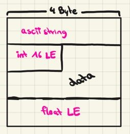
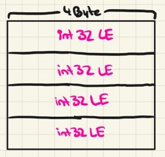
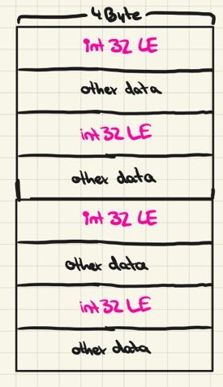
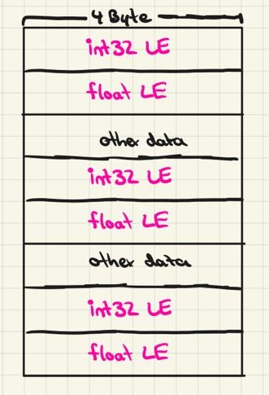

# smart-buffer-parser

Ever wanted to parse a buffer into a nicely structured javascript object and had _a lot_ of messy `buffer.read...()` calls? This ends now!

The `smart-buffer-parser` package offers an intuitive (and typesafe) way to convert a buffer to any kind of data structure.

# Examples

Let's get started quick and learn from simple examples!

### Example 1: Simple nested structures

Imagine your buffer is structured like this:



Assume you want to convert this buffer into the following type: 

```ts
type MyType = {
    label: string,  // 4 byte ascii string
    data: {
        id: number,     // 2 byte int
        value: number   // 4 byte float
    }
}
```

You can do that by specifying a _parsing structure_ as a parameter of the parse method.

```ts

const result: MyType = parse({
    label: new SimpleParseEntry({
        $offset: 0, // the offset is always specified in bytes
        $type: Type.STRING(4, "ascii")
    }),
    data: {
        id: new SimpleParseEntry({
            $offset: 4,
            $type: Type.INT16_LE
        }),
        value: new SimpleParseEntry({
            $offset: 12,
            $type: Type.FLOAT_LE
        }),
    }
}, buffer);
```

As you see, you simply create a `ParseEntry` whenever you need something from the buffer.

### Example 2: Arrays

Imagine your buffer is structured like this:



Assume you want to convert this buffer into a simple array: 

```ts
type MyType = number[];
```

Because our target type is not a nested structure, we directly pass a simple parse entry:

```ts
const result: MyType = parse(new SimpleParseEntry({
    $offset: 0,
    $type: Type.ARRAY(Type.INT32_LE),
    $size: 4
}), buffer);
```

To parse an array we simply utilized the `Type.ARRAY(...)` method and passed our item's type.

### Example 3: Arrays with gaps

Imagine your buffer is structured like this:



Again your buffer has an arrayish structure but there are some nasty gaps in there.

I don't see any problem, just use the `$gap` option and specify the gap's size in bytes🙃.
```ts
const result: MyType = parse(new SimpleParseEntry({
    $offset: 0,
    $type: Type.ARRAY(Type.INT32_LE),
    $gap: 4,
    $size: 4,
}), buffer);
```

### Example 4: Array structures (with gaps)

Imagine your buffer is structured like this:



Assume you want to convert this buffer into the following type: 

```ts
type MyType = ({
    id: number, // int32 LE
    value: number, // float LE
})[]; // <--- an array!
```

This is also easily possible! Just wrap your parsing structure (which would work for a single array item) in a `ArrayParseEntry` and specify the array's offset, size and item length (in bytes).


```ts
const result: MyType = parse(
    new ArrayParseEntry(
        {
            id: new SimpleParseEntry({
                $offset: 0, // relative to the offset specified in the array options
                $type: Type.INT32_LE,
            }),
            value: new SimpleParseEntry({
                $offset: 4,
                $type: Type.FLOAT_LE,
            }),
        }, 
        {
            $offset: 0, // the offset of the whole arrayish structure
            $itemByteLength: 8 + 4, // specify the length of a single item + the gap
            $size: 4
        }           
), buffer);
```

### Example 5: Transforming your data after it got parsed

It is also possible to transform your data after it got parsed to the specified `$type`.

Imagine you have the following buffer (see example 1):


Your target type is:

```ts
type MyType = {
    label: string,  // ascii string but capitalized
    id: string,     // int16 but as string
    float: number,  // float but multiplied with 2
}
```

You want to capitalize the ascii string, convert the int to a string and multiplicate the float with `2`.

Instead of using a `SimpleParseEntry` use a `TransformedParseEntry` and specify the `$transform` option.

This option expects a function of type `(value: ParseType) => TargetType`. _ParseType_ is the type specified in `$type`, _TargetType_ is the type of the property in `MyType`. 

This function gets executed after the buffer parsed the entry to the _ParseType_.


You should end up with the following code:
```ts
const result : MyType = parse({
    label: new TransformedParseEntry({
        $type: Type.STRING(4, "ascii"),
        $offset: 0,
        $transform: (val) => val.toUpperCase()
    }),
    id: new TransformedParseEntry({
        $type: Type.INT16_LE,
        $offset: 4,
        $transform: (val) => val.toString()
    }),
    value: new TransformedParseEntry({
        $type: Type.FLOAT_LE,
        $offset: 12,
        $transform: (val) => val * 2
    }),
}, buffer);
```

If your `$type` is an array (e.g. `Type.ARRAY(Type.INT32_LE`)) and want to transform every entry seperatably, you can use the `$transformItem` option which also provides the item's index.


### Example 6: Reusing parsed values

Imagine you have the following buffer (see example 1):


In our imaginary scenario the `int16` value stands for a current weather condition (`0 -> "sunny" | 1 -> "cloudy" | 2 -> "rainy" | 3 -> "snowy"`).

Assume you want to include the conditions id (the number itself) **and**  the parsed value (the string representation) in your target type:

```ts
type MyWeatherCondition = {
    conditionId: number,
    condition: string
}
```

You don't need to parse the integer twice, just parse it once and create a `DependencyParseEntry`.


```ts
const result: MyWeatherCondition = parse({
    conditionId: new SimpleParseEntry({
        $offset: 4,
        $type: Type.INT16_LE
    }),
    condition: new DependencyParseEntry({
        $dependsOn: "conditionId",
        $transform: (id) => {
            switch(id){
                case 0: return "sunny";
                case 1: return "cloudy";
                case 2: return "rainy";
                case 3: return "snowy";
                default: return "Unknown condition!";
            }
        }
    })
});
```

# Tips

- if you have multiple transform functions that you want to execute one after another use `Pipeline(fn1, fn2, fn3, ...)`
- if you want to automatically null your property if it matches a specified value use the `$nullables: [val1, val2, ...]` option
- if you want to automatically null your property if another property is null use the `$nullWith: "otherProperty"` option